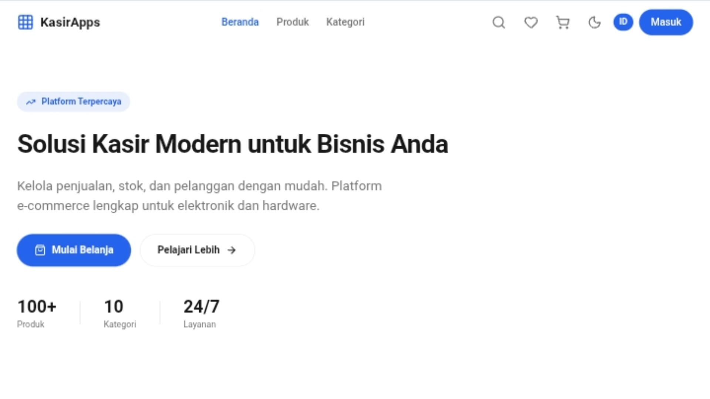

# KasirApps

<p align="center">
  
</p>

<p align="center">
  <strong>Modern POS / Marketplace Simulation Web Application</strong><br/>
  Project simulasi kasir modern berbasis web untuk presentasi sekolah.
</p>

<p align="center">
  
  
  
  
  
  
</p>

<p align="center">
  <a href="https://kasirapps-farid.vercel.app"><strong>Live Demo</strong></a> •
  <a href="https://github.com/R1dzzz/kasirapps-farid"><strong>Repository</strong></a>
</p>

---

## Preview

<p align="center">
  
</p>

---

## Overview

**KasirApps** adalah aplikasi simulasi kasir / marketplace modern berbasis web yang dibuat untuk kebutuhan presentasi sekolah dan pengembangan project praktik.

Project ini menampilkan pengalaman belanja digital yang interaktif mulai dari landing page, kategori produk, katalog produk, wishlist, cart, hingga simulasi checkout.

Aplikasi ini **bukan sistem transaksi nyata**. Seluruh fitur dibuat untuk simulasi presentasi dan demonstrasi alur aplikasi modern.

---

## Key Features

- Modern responsive landing page
- Product categories
- Product catalog
- Shopping cart simulation
- Wishlist
- Checkout flow simulation
- Multi language (Indonesia / English)
- Responsive layout
- Clean modern UI
- Supabase integration
- Vercel deployment

---

## Tech Stack

| Layer | Technology |
|---|---|
| Frontend | React, TypeScript, Vite |
| Styling | Tailwind CSS, shadcn/ui |
| Backend | Supabase |
| Deployment | Vercel |

---

## Project Structure

```text
kasirapps/
├── public/
│   ├── icon.png
│   └── preview-kasir.png
│
├── src/
│   ├── components/
│   ├── pages/
│   ├── hooks/
│   ├── stores/
│   ├── types/
│   ├── data/
│   ├── lib/
│   ├── App.tsx
│   └── main.tsx
│
├── index.html
├── package.json
├── vite.config.ts
└── tailwind.config.js
```

---

## Local Development

### Clone repository

```bash
git clone https://github.com/R1dzzz/kasirapps-farid.git
cd kasirapps-farid
```

### Install dependencies

```bash
npm install
```

### Run development server

```bash
npm run dev
```

Open in browser:

```text
http://localhost:5173
```

---

## Environment Variables

Create `.env`

```env
VITE_SUPABASE_URL=your_supabase_url
VITE_SUPABASE_ANON_KEY=your_supabase_anon_key
```

---

## Deployment

KasirApps is deployed using **Vercel**.

**Live Website**  
https://kasirapps-farid.vercel.app

---

## Database

KasirApps uses **Supabase** for:

- product categories
- product catalog
- cart
- wishlist
- transaction simulation

---

## SEO & Social Preview

This project includes:

- Open Graph meta tags
- favicon
- robots.txt
- sitemap.xml
- Google Search Console verification

---

## Notes

This project is intended for:

- learning
- school presentation
- practice
- UI/UX exploration
- frontend and cloud integration simulation

This project does **not** use:

- real payments
- production payment gateway
- real financial transactions

---

## Author

**Farid Alfiyansah**  
XI TJKT 2

GitHub: https://github.com/R1dzzz

---

## License

This project is created for educational, practice, and school presentation purposes.
